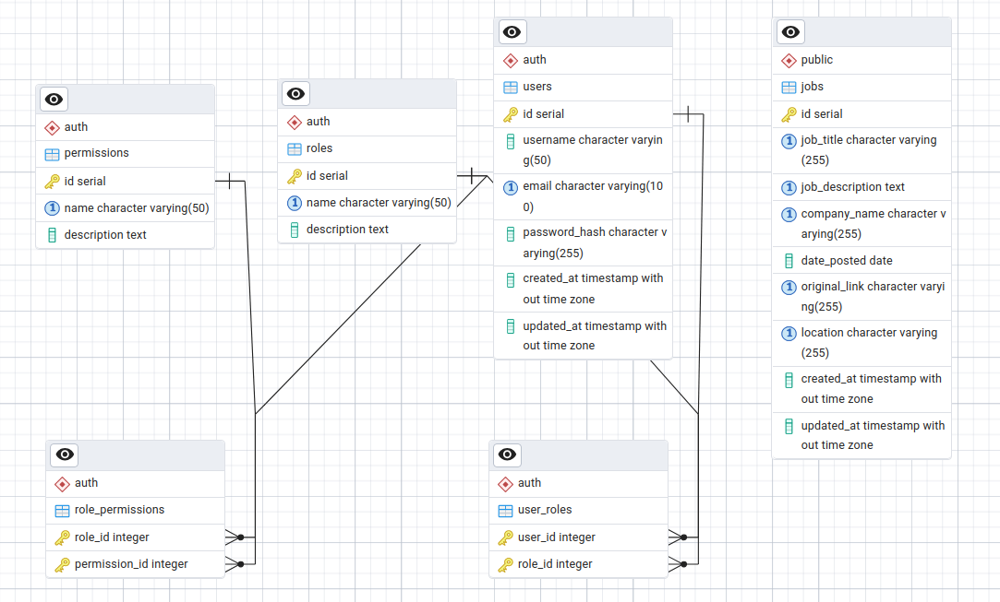

# Job platform
* Source code for a job advertisement website I am building. 
* The idea of this website is that recruiters post job advertisements and regular users can apply to these job postings. 
* Recruiters will receive a resume of the users. 

# Progress tracker
| Date       | Progress                  |
|------------|---------------------------|
| 2024-10-03 | Initial project setup     |
| 2024-10-04 | CRUD API for job posts, using JSON files as DB |
| 2024-10-05 | PostgreSQL DB configuration |
| 2024-10-06 | CRUD API for job posts, using postgreSQL |
| 2024-10-08 | CRUD API for user accounts |
| 2024-10-?? | *TODO User session management with JWT |


# Database ERD
See detailed description of schema in `config/README.md`


# Project folder structure
```
/job-platform
├── /node_modules       # Installed node modules (auto-generated)
├── /public             # Static assets like HTML, CSS, JS, images
├── /src
│   ├── *Controller.js  # Route handler logic (business logic)
│   ├── *Model.js       # Database models (e.g., Mongoose models)
│   ├── *Routes.js      # Route definitions (link routes to controllers)
│   ├── /Middleware.js  # Custom middleware (authentication, logging, etc.)
│   └── app.js          # Main app entry point, initializes Express
├── /config             # Configuration files (database, environment, etc.)
├── .env                # Environment variables (e.g., API keys)
├── .gitignore          # Ignored files and directories
├── package.json        # Project metadata and dependencies
├── package-lock.json   # Dependency tree lockfile (auto-generated)
└── server.js           # Starts the server
```
